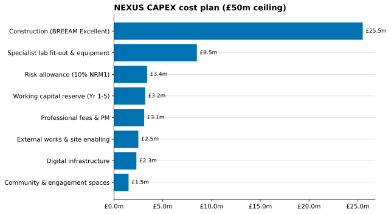
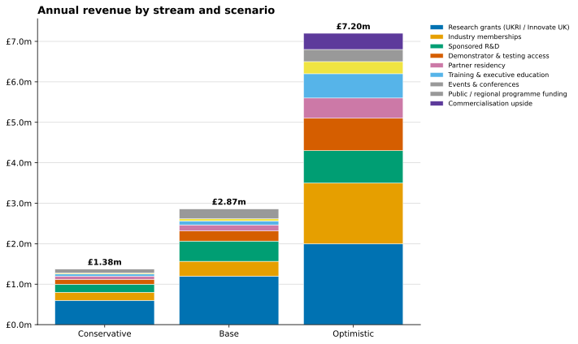
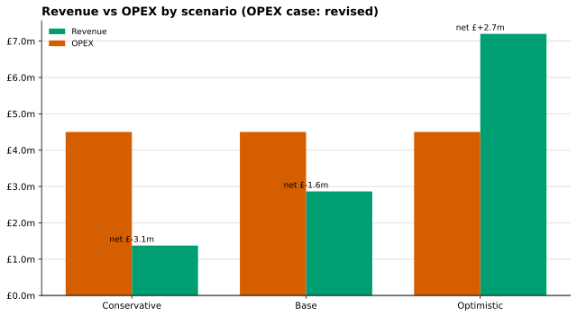
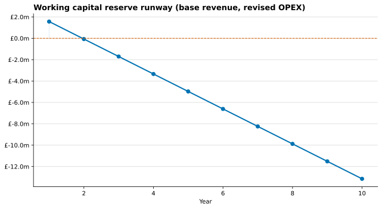

# NEXUS — Net Zero Energy Transition Exchange at Tyseley

A consultancy case study and reproducible financial model for a £50m interdisciplinary research facility, produced for the **University of Birmingham × Turner & Townsend Masters Consultancy Challenge 2026**.

The brief asked a student team to act as strategic consultants and build the investment case for a new net-zero research facility inside Tyseley Energy Park in East Birmingham. This repository holds the case study and a Python model that rebuilds every financial figure from a single assumptions file, so the numbers behind the proposal can be checked, changed and re-run.

---

## The proposal in one paragraph

Tyseley Energy Park already hosts a 10MW biomass plant, the UK's largest green hydrogen refuelling station, and the incoming £20m National Centre for the Decarbonisation of Heat. These assets sit next to each other but operate in isolation, and the University of Birmingham has no pilot or demonstration space to move its energy research toward deployment. NEXUS is a single 6,000 m² three-storey facility that connects them: three research pillars (BECCS carbon capture tied to the live biomass plant, a battery/hydrogen/vehicle-to-grid testbed, and a sustainable computing suite) around a shared collaboration spine, delivered inside a £50m ceiling over a 42-month programme.

---

## What's in here

| Path | Contents |
|------|----------|
| `README.md` | This case study |
| `data/assumptions.yaml` | Every financial figure, with the source draft noted for each |
| `src/nexus_model/` | The model: CAPEX, OPEX, revenue, ROI and charts |
| `scripts/run_model.py` | Runs the whole model and prints the tables |
| `notebooks/nexus_financial_model.ipynb` | Walk-through of the model with commentary |
| `docs/` | Facility concept, financial method, procurement, risk, pitch script |
| `assets/` | Generated charts |

---

## Quick start

```bash
pip install -r requirements.txt
python scripts/run_model.py
```

That prints the CAPEX cost plan and its ceiling check, the OPEX breakdown, the revenue scenarios, the operating position and the societal payback, then writes the charts to `assets/`. To explore the numbers interactively, open `notebooks/nexus_financial_model.ipynb`.

---

## The financial picture

### CAPEX — the £50m cost plan

The capital budget is a hard ceiling. The cost plan balances to exactly £50m, with construction and specialist lab fit-out taking two-thirds of the total.



The headline construction rate comes from a 60/40 spatial split: 60% high-specification lab space at £4,000/m² and 40% support space (offices, circulation, amenity) at £3,000/m², giving a blended base rate of £3,600/m². That sits below the £4,000–£6,500/m² BCIS 2026 range for university laboratories because of the space mix, not a discount.

### Revenue — three scenarios, built bottom-up

Revenue is modelled stream by stream, each with its own driver assumption (number of grant projects, membership tiers, demonstrator access days, and so on). The base case reaches £2.87m a year.



### Operating position — where the drafts don't agree

Run against the revised £4.5m annual OPEX, only the optimistic scenario covers its costs. This is the most important finding in the model, and it comes from reconciling figures that the challenge drafts left inconsistent.



The Executive Summary claims a £500k annual gap covered by the £3.2m working capital reserve for five years. That holds only if revenue is £4.0m. The auditable bottom-up base case reaches £2.87m, which leaves a gap near £1.6m and draws the reserve down inside two years.



The model reports this honestly rather than smoothing it over. The full reconciliation, including the earlier £1.9m OPEX case that produced the surplus shown in the pitch deck, is in [`docs/03-financial-model.md`](docs/03-financial-model.md).

### Societal return

Expressed as societal value in the style of HM Treasury Green Book appraisal, NEXUS is projected to generate £10.5m a year across direct revenue, research income uplift, regional economic multiplier, student employability and energy savings, a 4.8-year payback on the £50m investment, anchoring 4,365 jobs projected across the Tyseley Green Energy Innovation District.

---

## How the model is built

Every figure lives in `data/assumptions.yaml` with a comment naming the source draft. The code reads that file and computes the tables and charts, so there are no numbers hidden in the code. Change an assumption in the YAML and the whole model updates. This is what makes the case checkable rather than asserted.

---

## Documentation

- [01 — Facility concept](docs/01-facility-concept.md)
- [02 — Site and strategic rationale](docs/02-site-and-rationale.md)
- [03 — Financial model and reconciliation](docs/03-financial-model.md)
- [04 — Procurement and delivery](docs/04-procurement-and-delivery.md)
- [05 — Risk and stakeholders](docs/05-risk-and-stakeholders.md)
- [06 — Pitch script](docs/06-pitch-script.md)

---

## Notes and honesty

The figures are drawn from a team consultancy exercise and were written across several drafts that disagree in places. Where they conflict, this repository uses the version that balances and documents the choice. The construction rates are benchmarked against BCIS 2026 university laboratory data; the revenue assumptions are benchmarked against comparable UK innovation centres (National Composites Centre membership tiers, DETI industry leverage, Innovation Birmingham residency pricing). The societal value figures are indicative, in the manner of an early-stage business case, not an audited forecast.

Author: Abhinav Srivastava · [github.com/xbhxnxv](https://github.com/xbhxnxv) · [linkedin.com/in/abhinavsrivastav3011](https://linkedin.com/in/abhinavsrivastav3011)
